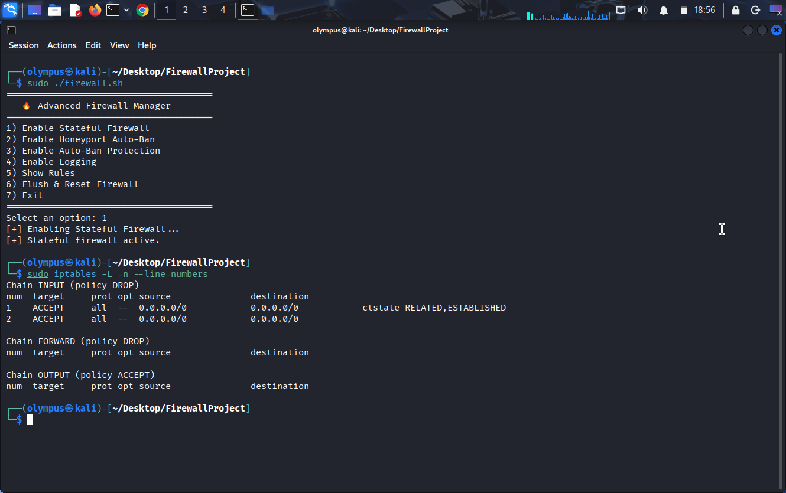
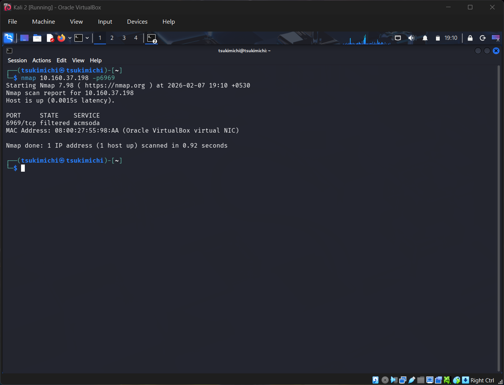
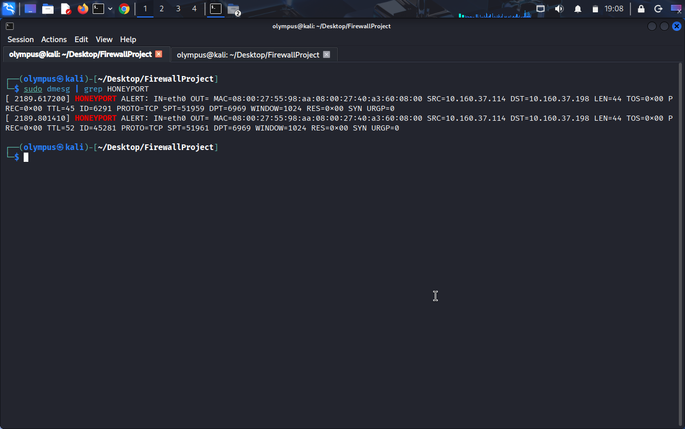

# 🔥 Advanced Linux Firewall & Intrusion Prevention System (IPS)

A Bash-driven Linux firewall built on iptables that implements stateful packet inspection, honeyport-based intrusion detection, and automated IP banning.  
This project demonstrates practical Blue-Team and Purple-Team skills in host-level defense and automated threat response.

---

## 📌 Project Overview

This project focuses on strengthening host security by actively monitoring and filtering network traffic. 
It detects suspicious behavior such as port scans and brute-force attempts, then dynamically applies defensive rules to block attackers.

The goal is to showcase how Linux firewalls can be tuned beyond basic filtering to provide real-time intrusion prevention.

---

## 🚀 Features

✅ Stateful firewall using conntrack
✅ Honeyport intrusion detection & auto-ban
✅ Fail2ban-style brute-force protection 
✅ Netfilter logging for threat visibility 
✅ Modular Bash automation 
✅ Safe firewall reset mechanism 

---

## 🛠️ Technologies Used

- Bash scripting 
- iptables / netfilter 
- Linux networking 
- TCP/IP fundamentals 
- conntrack module 

⚙️ Installation & Usage

1️⃣ Clone the repository

    git clone https://github.com/yourusername/Advanced-Firewall-IPS.git

    cd Advanced-Firewall-IPS

2️⃣ Make script executable

    chmod +x firewall_super_advanced.sh

3️⃣ Run the firewall

    sudo ./firewall_super_advanced.sh

🧪 Testing

You can test detection using:

Port scanning

    nmap <target-ip>

Connection attempts

    nc -zv <target-ip> <port>

View logs

    sudo dmesg | grep IPTABLES

📷 Screenshots

🛡️ Learning Outcomes

Practical firewall rule design

Threat detection using logs

Automated defensive response

Attack surface reduction techniques

Blue-Team and Purple-Team thinking

⚠️ Disclaimer

This project is for educational and research purposes only.
Do not deploy on production systems without proper testing.

👤 Author

Harshil Makwana

Cybersecurity Enthusiast | Blue Team | Defensive Security

⭐ Future Improvements

nftables version

Web dashboard for monitoring

Geo-IP blocking

IDS/IPS integration (Suricata/Snort)
