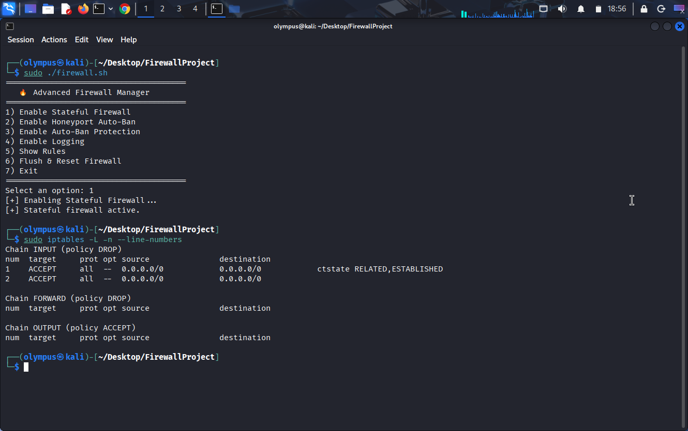
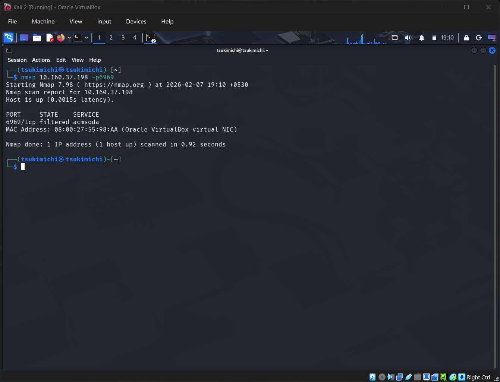
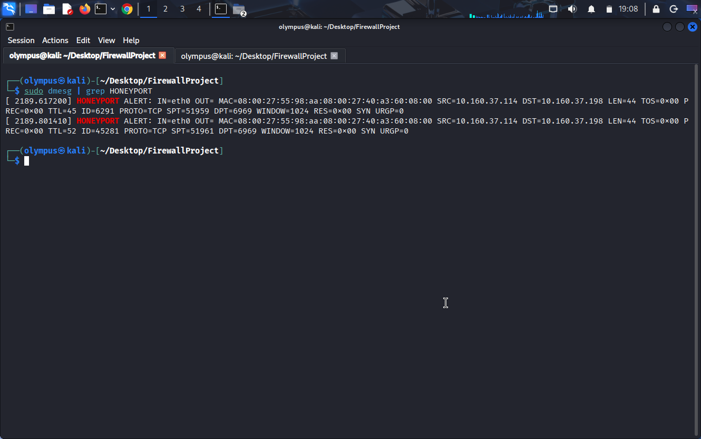

# Advanced Linux Firewall & IPS

A Bash/iptables stateful firewall with honeyport-based intrusion detection and automated IP banning. Built to understand how host-level defences actually work — by building one from scratch, then attacking it.

---

## Results

Across all lab test scenarios — port scans, brute-force attempts, connection floods:

| Metric | Result |
|---|---|
| Intrusion prevention rate | 100% across all scenarios |
| Auto-ban trigger time | Under 10 seconds from first anomalous connection |
| Full Linux host hardening time | Under 30 minutes from clean state |

---

## Why I built this

Understanding how firewalls fail requires understanding how they work from the inside. I wanted to build something production-realistic rather than configure an existing tool — so I wrote the detection logic, the banning mechanism, and the hardening steps from scratch.

The honeyport approach was the most interesting part. Instead of matching known attack signatures (which attackers can evade), it watches for connections to ports that legitimate traffic would never touch. Any connection to those ports is suspicious by definition — no signature needed.

After building it, I tested it offensively using nmap, Hydra, and netcat to validate that the detection logic actually caught what it was supposed to.

---

## How it works

**Stateful packet inspection** via iptables conntrack — only established and related connections are permitted inbound. All new inbound connections go through explicit allow rules.

**Honeyport IDS** — a set of ports are left deliberately open but unserviced. Any connection attempt to these ports triggers an immediate log entry and fires the auto-ban logic.

**Automated IP banning** — a Bash watchdog monitors the iptables log and inserts DROP rules for offending IPs within 10 seconds of detection. Bans persist for the duration of the session.

**Rate-limiting** — connection rate limiting drops IPs that exceed the configured threshold per time window, functioning as brute-force protection.

---

## Setup

```bash
git clone https://github.com/Harshil015/Advanced-Firewall-IPS.git
cd Advanced-Firewall-IPS
chmod +x firewall.sh
sudo ./firewall.sh
```

Root privileges are required — iptables rules require kernel-level access.

**To reset all rules** (restore default ACCEPT policy):

```bash
sudo iptables -F
sudo iptables -X
sudo iptables -P INPUT ACCEPT
sudo iptables -P FORWARD ACCEPT
sudo iptables -P OUTPUT ACCEPT
```

---

## Testing the detection

**Port scan detection:**

```bash
nmap -sS <target-ip>
```

Watch for the auto-ban triggering in the iptables log.

**Honeyport trigger:**

```bash
nc <target-ip> <honeyport>
```

Any connection to a honeyport should result in an immediate DROP rule insertion.

**Monitor the log in real time:**

```bash
sudo dmesg | grep IPTABLES
sudo tail -f /var/log/syslog | grep IPTABLES
```

---

## Attack scenarios tested

- SYN scan and full connect scan (nmap)
- Brute-force login (Hydra)
- Honeyport connection attempts (netcat)
- Connection flood (manual burst testing)
- Sequential port knock attempts

---

## Screenshots

Firewall rules active and loaded:



Honeyport detection firing and ban inserting:




---

## Limitations

- IPv4 only — no IPv6 rule support
- Bash watchdog must remain running for auto-ban to function
- Tested on Ubuntu 22.04 and Kali Linux; not validated on distros where nftables is the default
- Ban rules are not persistent across reboots by default — use `iptables-persistent` for permanence
- Rate-limit thresholds are hardcoded — no config file yet

---

## Roadmap

- [ ] nftables port for modern distros
- [ ] Config file for threshold and honeyport customisation
- [ ] Persistent ban list across reboots
- [ ] Web dashboard for active rule and ban monitoring
- [ ] Geo-IP block integration
- [ ] Slack/email alerting on ban events

---

## Legal disclaimer

For lab and educational use only. Do not deploy on production systems or any network without proper testing and explicit authorisation from the system owner.

---

## Author

**Harshil Makwana** — ECE graduate from SVNIT Surat  
[linkedin.com/in/harshilmakwana](https://linkedin.com/in/harshilmakwana) · [github.com/Harshil015](https://github.com/Harshil015)
